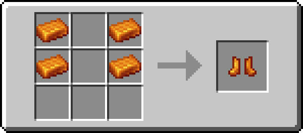

# Palladium Armor

!!! info inline end ""
    

    <h3>**Palladium Armor**</h3>
    

    

    <h4>**Palladium Helmet**</h4>
    { .sized-image style="--image-width: 40%;" } 
    { .sized-image style="--image-width: 8%;" }
    { .sized-image style="--image-width: 8%;" }
     
    +3 Armor, +2.0 Toughness 
    336 Durability 

    

    <h4>**Palladium Chestplate**</h4>
    { .sized-image style="--image-width: 40%;" } 
    { .sized-image style="--image-width: 8%;" }
    { .sized-image style="--image-width: 8%;" }
    { .sized-image style="--image-width: 8%;" }
    { .sized-image style="--image-width: 8%;" }
     
    +8 Armor, +2.0 Toughness 
    448 Durability 

    

    <h4>**Palladium Leggings**</h4>
    { .sized-image style="--image-width: 40%;" } 
    { .sized-image style="--image-width: 8%;" }
    { .sized-image style="--image-width: 8%;" }
    { .sized-image style="--image-width: 8%;" }
     
    +6 Armor, +2.0 Toughness 
    420 Durability 

    

    <h4>**Palladium Boots**</h4>
    { .sized-image style="--image-width: 40%;" } 
    { .sized-image style="--image-width: 8%;" }
    { .sized-image style="--image-width: 8%;" }
     
    +3 Armor, +2.0 Toughness 
    364 Durability 
    ---
    *Ability - Natural Fire Protection:*  
    Acts as extra levels of Fire Protection when worn. 

Palladium Armor is a set of orange armor set which has multiple fire related properties. This armor is fireproof, similar to Netherite, and will therefore **not burn if dropped in lava**.

Most of the pieces have the Movement Speed in Lava attribute, which does exactly what its named after. The helmet comes with the Vision in Lava attribute instead, which increases your vision range when submerged in Lava by the specified number of blocks. 

The set also comes with the Natural Fire Protection ability, which acts as one extra level of the Fire Protection enchantment when worn. This ability stacks with the enchantment itself. 

## Obtaining
### Crafting
Palladium Armor can be crafted from [Palladium Ingots](https://youtu.be/6wWHZE14hP8), which is a resource found in The Nether. It is crafted just like any other armor.

{ .sized-recipe style="--image-width: 40%;" } 
{ .sized-recipe style="--image-width: 40%;" } 
{ .sized-recipe style="--image-width: 40%;" } 
{ .sized-recipe style="--image-width: 40%;" } 

## Trivia
Palladium Armor counts as warm armor, as it is in the `minecraft:freeze_immune_wearables` tag. This mean you will not take freeze damage when wearing any piece of it.

Palladium Boots also have some interesting applications, as when wearing them you can stand on Campfires and Magma Blocks without taking damage. You will also not sink in Powder Snow when wearing these boots, unless you are sneaking. 