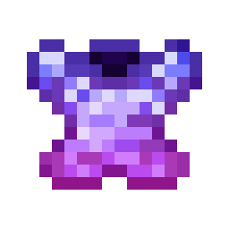
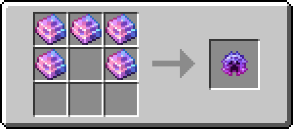
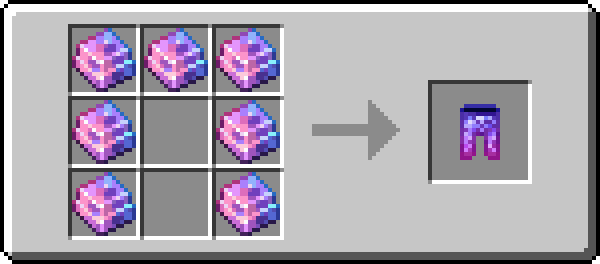

# Stormyx Armor

!!! info inline end ""
    

    <h3>**Stormyx Armor**</h3>
    
    <h4>**Stormyx Helmet**</h4>
    { .sized-image style="--image-width: 40%;" } 
    { .sized-image style="--image-width: 8%;" }
    { .sized-image style="--image-width: 8%;" }
     
    +3 Armor, +2.0 Toughness 
    360 Durability 

    

    <h4>**Stormyx Chestplate**</h4>
    { .sized-image style="--image-width: 40%;" } 
    { .sized-image style="--image-width: 8%;" }
    { .sized-image style="--image-width: 8%;" }
    { .sized-image style="--image-width: 8%;" }
    { .sized-image style="--image-width: 8%;" }
     
    +8 Armor, +2.0 Toughness 
    480 Durability 

    

    <h4>**Stormyx Leggings**</h4>
    { .sized-image style="--image-width: 40%;" } 
    { .sized-image style="--image-width: 8%;" }
    { .sized-image style="--image-width: 8%;" }
    { .sized-image style="--image-width: 8%;" }
     
    +6 Armor, +2.0 Toughness 
    450 Durability 

    

    <h4>**Stormyx Boots**</h4>
    { .sized-image style="--image-width: 40%;" } 
    { .sized-image style="--image-width: 8%;" }
    { .sized-image style="--image-width: 8%;" }
     
    +3 Armor, +2.0 Toughness 
    390 Durability 
    ---
    *Ability - Magic Protection:*  
    Flat magic damage reduction by X points. 
    

Stormyx Armor is a standard armor set, recognized from its distinct pink and cyan colors. The armor has the Magic Protection attribute, which decreases damage taken from magical sources by the flat amount. 

## Obtaining
### Crafting
Stormyx Armor can be crafted from [Stormyx Ingots](https://youtu.be/nEmXCTZN154), which is a resource found in The Nether. It is crafted just like any other armor.

{ .sized-recipe style="--image-width: 40%;" } 
{ .sized-recipe style="--image-width: 40%;" } 
{ .sized-recipe style="--image-width: 40%;" } 
{ .sized-recipe style="--image-width: 40%;" } 
### Bartering
Occasionally when bartering  with Piglins using Midas Gold, you have a small chance to obtain Stormyx Boots enchanted with Soul Speed and/or Unbreaking. The chance for this is around 1% per barter. 

