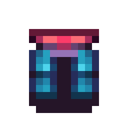
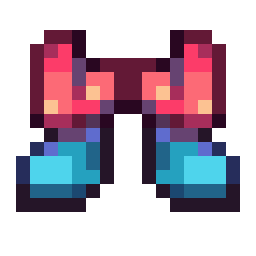
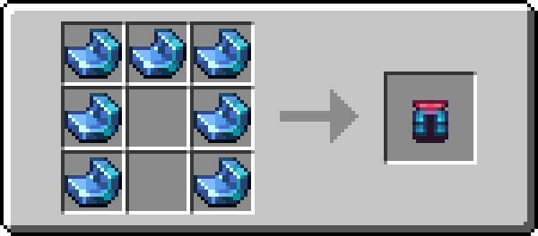

!!! info inline end ""
    

    <h3>**Aquarium Armor**</h3>
     

	<h4>**Aquarium Helmet**</h4>
	{ .sized-image style="--image-width: 40%;" } 	{ .sized-image style="--image-width: 8%;" }
	 
	+2 Armor 
	240 Durability 

	<h4>**Aquarium Chestplate**</h4>
	{ .sized-image style="--image-width: 40%;" } 	{ .sized-image style="--image-width: 8%;" }
	{ .sized-image style="--image-width: 8%;" }
	{ .sized-image style="--image-width: 8%;" }
	 
	+5 Armor 
	320 Durability 

	<h4>**Aquarium Leggings**</h4>
	{ .sized-image style="--image-width: 40%;" } 	{ .sized-image style="--image-width: 8%;" }
	{ .sized-image style="--image-width: 8%;" }
	 
	+4 Armor 
	300 Durability 

	<h4>**Aquarium Boots**</h4>
	{ .sized-image style="--image-width: 40%;" } 	{ .sized-image style="--image-width: 8%;" }
	 
	+1 Armor 
	260 Durability 

## Obtaining

### Crafting

This armor can be crafted from [TODO - LINK TO MATERIAL.]

{ .sized-image style="--image-width: 40%;" }
{ .sized-image style="--image-width: 40%;" }
{ .sized-image style="--image-width: 40%;" }
{ .sized-image style="--image-width: 40%;" }

## Usages

TODO - Remove if irrelevant, for example if it does not craft into anything

## Trivia

## History

