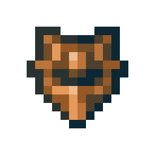
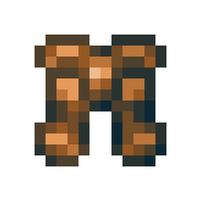

!!! info inline end ""
    

    <h3>**Banglum Armor**</h3>
     

	<h4>**Banglum Helmet**</h4>
	{ .sized-image style="--image-width: 40%;" } 	{ .sized-image style="--image-width: 8%;" }
	{ .sized-image style="--image-width: 8%;" }
	 
	+3 Armor 
	168 Durability 

	<h4>**Banglum Chestplate**</h4>
	{ .sized-image style="--image-width: 40%;" } 	{ .sized-image style="--image-width: 8%;" }
	{ .sized-image style="--image-width: 8%;" }
	{ .sized-image style="--image-width: 8%;" }
	 
	+6 Armor 
	224 Durability 

	<h4>**Banglum Leggings**</h4>
	{ .sized-image style="--image-width: 40%;" } 	{ .sized-image style="--image-width: 8%;" }
	{ .sized-image style="--image-width: 8%;" }
	{ .sized-image style="--image-width: 8%;" }
	 
	+5 Armor 
	210 Durability 

	<h4>**Banglum Boots**</h4>
	{ .sized-image style="--image-width: 40%;" } 	{ .sized-image style="--image-width: 8%;" }
	 
	+2 Armor 
	182 Durability 

## Obtaining

### Crafting

This armor can be crafted from [TODO - LINK TO MATERIAL.]

{ .sized-image style="--image-width: 40%;" }
{ .sized-image style="--image-width: 40%;" }
{ .sized-image style="--image-width: 40%;" }
{ .sized-image style="--image-width: 40%;" }

## Usages

TODO - Remove if irrelevant, for example if it does not craft into anything

## Trivia

## History

