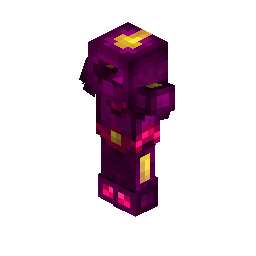
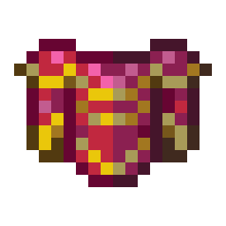
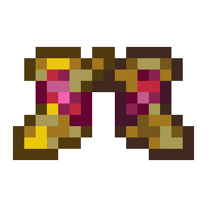
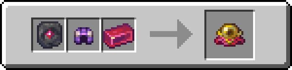
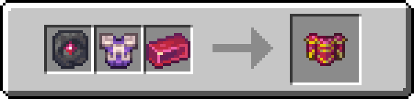
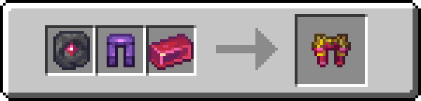
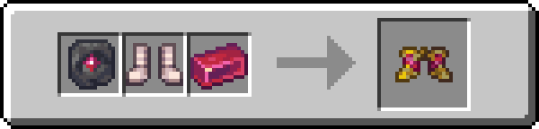

!!! info inline end ""
    

    <h3>**Carmot Armor**</h3>
     

	<h4>**Carmot Helmet**</h4>
	{ .sized-image style="--image-width: 40%;" } 	{ .sized-image style="--image-width: 8%;" }
	{ .sized-image style="--image-width: 8%;" }
	 
	+3 Armor 
	312 Durability 

	<h4>**Carmot Chestplate**</h4>
	{ .sized-image style="--image-width: 40%;" } 	{ .sized-image style="--image-width: 8%;" }
	{ .sized-image style="--image-width: 8%;" }
	{ .sized-image style="--image-width: 8%;" }
	{ .sized-image style="--image-width: 8%;" }
	 
	+8 Armor 
	416 Durability 

	<h4>**Carmot Leggings**</h4>
	{ .sized-image style="--image-width: 40%;" } 	{ .sized-image style="--image-width: 8%;" }
	{ .sized-image style="--image-width: 8%;" }
	{ .sized-image style="--image-width: 8%;" }
	 
	+6 Armor 
	390 Durability 

	<h4>**Carmot Boots**</h4>
	{ .sized-image style="--image-width: 40%;" } 	{ .sized-image style="--image-width: 8%;" }
	{ .sized-image style="--image-width: 8%;" }
	 
	+3 Armor 
	338 Durability 

## Obtaining

### Crafting

This armor can be crafted from [TODO - LINK TO MATERIAL.]

{ .sized-image style="--image-width: 40%;" }
{ .sized-image style="--image-width: 40%;" }
{ .sized-image style="--image-width: 40%;" }
{ .sized-image style="--image-width: 40%;" }

## Usages

TODO - Remove if irrelevant, for example if it does not craft into anything

## Trivia

## History

