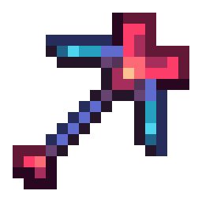
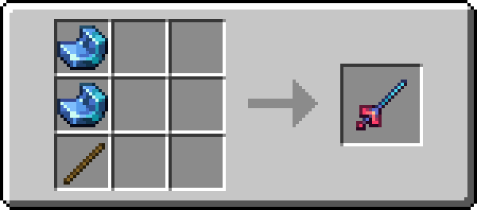

!!! info inline end ""
    

    <h3>**Aquarium Sword**</h3>
    { .sized-image style="--image-width: 40%;" } 
    +6.0 Attack Damage, 1.6 Attack Speed 
    455 Durability 
    <h3>**Aquarium Axe**</h3>
    { .sized-image style="--image-width: 40%;" } 
    +8.0 Attack Damage, 0.9 Attack Speed 
    455 Durability 
    <h3>**Aquarium Pickaxe**</h3>
    { .sized-image style="--image-width: 40%;" } 
    +5.0 Attack Damage, 1.2 Attack Speed 
    455 Durability 
    <h3>**Aquarium Shovel**</h3>
    { .sized-image style="--image-width: 40%;" } 
    +4.0 Attack Damage, 1.1 Attack Speed 
    455 Durability 
    <h3>**Aquarium Hoe**</h3>
    { .sized-image style="--image-width: 40%;" } 
    +3.0 Attack Damage, 1.0 Attack Speed 
    455 Durability 

## Obtaining

### Crafting

Tools can be crafted from [TODO - LINK TO MATERIAL.]

{ .sized-image style="--image-width: 40%;" }
{ .sized-image style="--image-width: 40%;" }
{ .sized-image style="--image-width: 40%;" }
{ .sized-image style="--image-width: 40%;" }
{ .sized-image style="--image-width: 40%;" }

## Usages

TODO - Remove if irrelevant, for example if it does not craft into anything

## Trivia

## History

