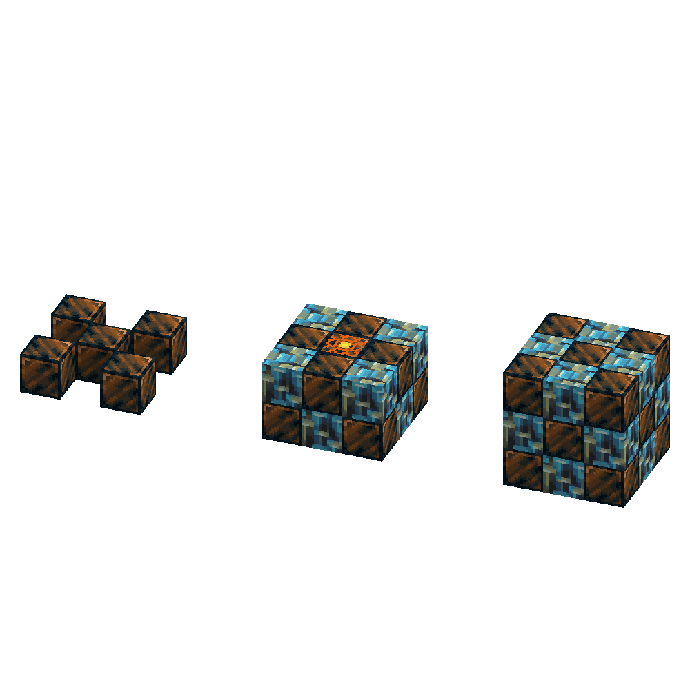

*War... War never changes*

So you want to learn how to build a nuke, huh? Well, its not so hard as you think. Does require a lot of specialized materials.

## Multiblock

You are going to need a lot of Banglum and Morkite. The multiblock is going to cost you 14 blocks of Banglum Blocks, and 12 blocks of Morkite, structured like this:

For the core of the bomb you need a Banglum Chunk as well.

![Picture of the recipe of a Banglum Nuke Core. [BMB][MCM][BMB] B = Raw Banglum Block, M = Morkite Block, C = Banglum Chunk](../../assets/mythicmetals/recipes/blocks/banglum_nuke_core.png){ .sized-recipe style="--image-width: 50%;" } 

To finally light it, simply use your trusty Flint and Steel...

... and get out as fast as you can.

---

## Unique Nuke Cores

Some might ask: "How do you use the different Nuke Cores?"

Well, it is simple: replace the Banglum Nuke Core with the new one when building it. Nothing more, nothing less.

### Carmot Nuke Core

Using this nuke core, the explosion will magically exclude all ores when it explodes

{ .sized-recipe style="--image-width: 50%;" } 

### Quadrillum Nuke Core

This nuke core will sacrifice some of the radius, while doubling the damage dealt from the explosion

{ .sized-recipe style="--image-width: 50%;" } 
