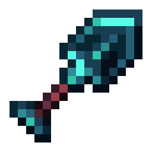
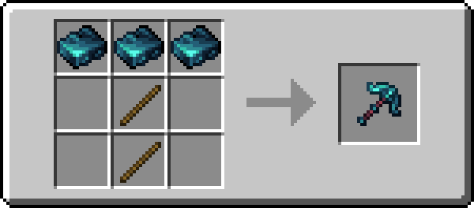

!!! info inline end ""
    

    <h3>**Quadrillum Sword**</h3>
    { .sized-image style="--image-width: 40%;" } 
    +6.7 Attack Damage, 1.5 Attack Speed 
    321 Durability 
    <h3>**Quadrillum Axe**</h3>
    { .sized-image style="--image-width: 40%;" } 
    +8.7 Attack Damage, 0.8 Attack Speed 
    321 Durability 
    <h3>**Quadrillum Pickaxe**</h3>
    { .sized-image style="--image-width: 40%;" } 
    +5.7 Attack Damage, 1.1 Attack Speed 
    321 Durability 
    <h3>**Quadrillum Shovel**</h3>
    { .sized-image style="--image-width: 40%;" } 
    +4.7 Attack Damage, 1.0 Attack Speed 
    321 Durability 
    <h3>**Quadrillum Hoe**</h3>
    { .sized-image style="--image-width: 40%;" } 
    +3.7 Attack Damage, 0.9 Attack Speed 
    321 Durability 

## Obtaining

### Crafting

Tools can be crafted from [TODO - LINK TO MATERIAL.]

{ .sized-image style="--image-width: 40%;" }
{ .sized-image style="--image-width: 40%;" }
{ .sized-image style="--image-width: 40%;" }
{ .sized-image style="--image-width: 40%;" }
{ .sized-image style="--image-width: 40%;" }

## Usages

TODO - Remove if irrelevant, for example if it does not craft into anything

## Trivia

## History

