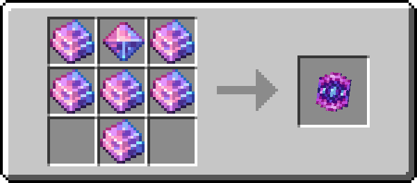

# Stormyx Shield

!!! info inline end ""
    

    <h3>**Stormyx Shield**</h3>
    { .sized-image style="--image-width: 40%;" } 
    +2 Magic Protection 
    1680 Durability 
    ---
    *Ability - Magic Protection:*  
    Flat magic damage reduction by X points. 
    

The Stormyx Shield is a magical round shield crafted from [Stormyx](../materials/stormyx.md).

Compared to a standard shield it has some minor benefits. Firstly it can take a higher amount of damage before losing durability. A standard shield can absorb 3 points of damage before losing durability, while a Stormyx Shield can absorb 4 points. It also rounds down during this durability damage calculation instead of up.

Secondly, when disabled by an axe, it goes on a second shorter cooldown of 4 seconds (80 ticks), allowing you to start using it quicker.

## Obtaining

### Crafting

The Stormyx Shield is crafted from [Stormyx Ingots](https://youtu.be/nEmXCTZN154), which is a resource found in The Nether. You also need a [Stormyx Shell](../materials/rare-drops.md), a rare dropped which is obtained while mining Stormyx Ores.

{ .sized-recipe style="--image-width: 40%;" } 
