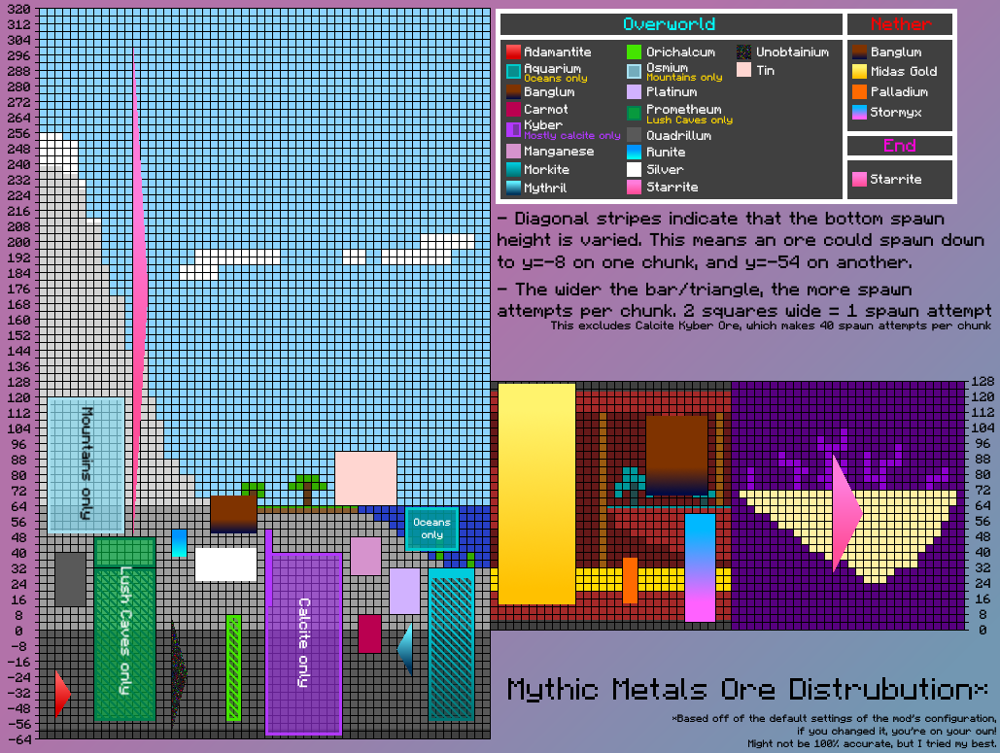

# Frequently Asked Questions and Answers

## Is there a guide for this mod?

Read the advancements. They contain tons of detailed information about what materials are interesting, as well as recipes for alloys. Note that two of the advancement have Alloy Forgery Forge Controllers in them. These are direct hints in what Tier you need to forge the specific alloys.

## How do I make alloys?

[Create an Alloy Forge.](https://modrinth.com/mod/alloy-forgery) In a general unmodified Mythic Metals context a Tier 2 Forge can create any alloy.

## How do I craft X?

All recipes follow vanilla patterns. For example when crafting a pickaxe follow the pickaxe pattern (i.e. 3 stone and two sticks), or use the [associating smithing template](#where-can-i-find-smithing-templates).

The rest, including **Alloy Recipes**, can be viewed using recipe viewers like [Roughly Enough Items](https://www.curseforge.com/minecraft/mc-mods/roughly-enough-items) or [EMI](https://modrinth.com/mod/emi). As of writing Just Enough Items (JEI) is not supported.

## Where can I find X?

Most of the ores spawn in the Overworld, some spawn in The Nether. End Stone Starrite spawns in The End. There are some biome-exclusive ores, listed here:

- Aquarium: Spawns in Aquatic Biomes, like Rivers and Oceans
- Prometheum: Spawns in Warm Biomes, like Lush Caves, or Jungles
- Osmium: Spawns in Mountains

For where ores spawn specifically, this will eventually make its way into the wiki in the Material section. For now you can enjoy this chart made by Mkat420 (yes, it is still *mostly* accurate)

### Related biome tags (technical stuff)

- Overworld: spawns anywhere in the `#mythicmetals:mythic_ore_biomes` tag, which includes `#c:in_overworld`
- Aquarium: spawns anywhere in the `#mythicmetals:aquarium_biomes` tag, which includes `#c:is_aquatic`
    - In older versions (below 0.20.2) this used to be only `#c:aquatic`
- Prometheum: spawns anywhere in the `#mythicmetals:prometheum_biomes` tag, which includes `#minecraft:is_jungle`
- Osmium: spawns anywhere in the `#mythicmetals:osmium_biomes` tag, which includes `#c:mountain` and `#c:extreme_hills`
- The Nether and The End are currently not tag-driven, and simply uses Fabric API to insert into all relevant biomes. In the future this might be changed.

## Can I mine this?

Mythic Metals follows the vanilla progression closely. As a rule of thumb: Once you get a Netherite Pickaxe you can mine any ore in the mod. There are however **multiple pickaxes in the mod that also have this mining level**. As of writing the following pickaxes have this mining level:

- Hallowed
- Adamantite
- Mythril
- Orichalcum
- Palladium
- Star Platinum

Once the wiki is complete, it will contain information on which mining levels *tools have*, and what mining levels *ores require*.

## What does X material do?

This one will eventually be answered once the Material section is filled out. For now you can see the following subquestions:

### How does Branding work?

You apply the Heat status effect to your targets by hitting them with a Palladium tool, and once they are hot enough light them on fire to make them combust! This heavily increases the fire damage and duration of their burn. Use this to your advantage in places where water is scarce (or simply drain the nearby water).

The way this works is that the effect applies Fire Vulnerability. An extra effect of this is that Fire Resistance will not make you fully immune against burning, only reducing the damage.

### How do the Prometheum abilities work?

#### Regrowth

Prometheum equipment with this ability will automatically repair itself while in your inventory or equipped.

In older versions of the mod (below 0.20.0), the effect was the following:

- For armor, it must be equipped for this to take effect
- For tools, it must be in your main hand or off hand to repair itself

#### Overgrown

Regrowth will track how much durability has been restored. Once you hit a threshold of durability regained, the armor will gain additional stats. The Regrowth self-repair effect will also increase when Overgrown.

In the latest versions (0.20.0 and above), the thresholds are the following:

- At 1200 durability repaired, tools gain +1 damage. Armor gains +1 armor and armor toughness.
- At 2400 durability repaired, the bonuses above increase to the following:
    - +2 damage for tools
    - +2 armor & toughness for armor

In the older versions, the thresholds looks like this:

- From 0.19.5 to 0.19.9, the double threshold was added to tools only.
- In 0.19.4 and below this double threshold did not exist.
- In 0.18.2 and below, the threshold was 2000 durability.

#### Engrained

If you apply Curse of Binding on the Armor, it will gain additional stats (+1 toughness and +8% attack speed per piece), as well as an increase on the Regrowth effect.

## Where can I find Smithing Templates?

Here are the directions of how to obtain the Smithing Tables (up-to-date as of 0.18.2):

- Unobtainium Alloy Upgrade
    - Found in Ancient Cities
    - Allows you to craft Metallurgium and Celestium Gear from Netherite and Diamond respectively
    - Can be duplicated with Diamonds and Deepslate
- Royal Midas Gold Sword Upgrade
    - Rarely found when bartering with Piglins using Midas Gold
    - Allows you to upgrade a maxed Gilded Midas Gold Sword into its final form...
    - Can be duplicated with Diamonds and Deepslate
- Mythril Drill Upgrade
    - Found in Mineshafts
    - Upgrades a Mythril Pickaxe, using a Durasteel engine, into a Mythril Drill
    - Can be duplicated with Diamonds and Deepslate
- Midas Gold Folding
    - Crafted in the crafting table using Midas Gold and Netherrack
    - Used to increase the gold counter on any Midas Gold Swords by 1
    - Can be duplicated for nuggets once you have made one
- Carmot Staff
    - Found in Village Temple chests. In vanilla this only spawns in Desert Village Temples
    - Not to be confused with Desert Temples, which resemble pyramids. The structure you are looking for is more like a small sandstone castle
    - Can be duplicated with Diamonds and Smooth Basalt
- Carmot Upgrade
    - Crafted from Carmot, Diamonds, and Smooth Basalt
    - Upgrades Kyber Gear into its Carmot equivalent
    - Can be duplicated using Carmot, Smooth Basalt, and Carmot Nuggets
- Legendary Banglum Upgrade
    - Crafted from Banglum Ingots and Tuff
    - Upgrades Banglum Gear to its Legendary variant using a Banglum Chunk
- Aegis Sword Upgrade
    - Obtained from trading with Villagers, specifically Master level Clerics
    - Can upgrade a Palladium Sword to the Blade of the Aegis
    - Can upgrade a Hallowed Sword to the Sword of the Aegis

## How do I upgrade a Mythril Drill?

Any item with the tooltip "Mythril Drill Upgrade" should be insertable in the Mythril Drill. Simply right click the upgrade item onto the drill to insert it. A video example is below. This is the same mechanics as the [Bundle](https://minecraft.wiki/w/Bundle) uses.

For the available list of Drill Upgrades, see the following table:

| Method      | Description                          | Relevant versions   |
| :---------: | :----------------------------------  | :---:               |
| Enchanted Midas Gold Block | Golden Luck - Gives you +2 Luck while holding the drill, and randomly drops raw gold when breaking an ore.  | 0.18.0+ |
| Prometheum Bouquet | Slowly repairs the durability of the drill. | 0.18.0+ |
| Aquarium Pearl | Aqua Affinity - Increases your mining speed underwater, and restores a small amount of air when breaking an ore.  | 0.17.0+ |
| Stormyx Shell | Banglum Defuser - Drastically reduces the chance of Banglum exploding. | 0.17.0+ |
| Carmot Stone | +1 Fortune - Increases the level of Fortune on your drill by one level. | 0.18.0+ |

## How much Midas Gold can you fold onto a Midas Gold Sword?

I don't remember the exact amount. It stops getting new stats after 20 stacks of blocks, *I think...*

## What blocks can I put into the Carmot Staff?

Literally anything inside the vanilla Minecraft and Mythic Metals. You cannot put a used Shulker Box though, as you would void your items doing so.

Any Blocks in the `#mythicmetals:carmot_staff_blocks` are considered unique, and have an associated effect. See the following table:

| Block       | Description                                                                     | Relevant Versions|
| :---------: | :-----------------------------------------------------------------------------  | :--------------: |
| Iron | Fling opponents up, makes the staff stronger.                                          | 0.14.0+          |
| Gold | Grant yourself luck for two minutes.                                                   | 0.14.0+          |
| Copper | Summon lightning on yourself.                                                        | 0.14.0+          |
| Diamond | Makes the staff stronger.                                                           | 0.14.0+          |
| Bronze | Smite whoever you strike with lightning.                                             | 0.14.0+          |
| Netherite | Powerful melee weapon, makes the staff much stronger.                             | 0.14.0+          |
| Metallurgium | Highest single hit damage in the entire mod, but extremely slow.               | 0.14.0+          |
| Carmot | Heals you and everything around you for 10 points (5 hearts) of health.              | 0.14.2+          |
| Midas Gold | Grants you and everyone around you Luck 2 for four minutes.                      | 0.14.2+          |
| Runite | Barrages your enemies in ice, freezing them in place.                                | 0.14.2 to 0.16.4 |
| Star Platinum | Lets you swing the staff really fast.                                         | 0.14.2+          |
| Beacon | Grants players in a large radius (18 blocks) a random beacon effect for 30 seconds.  | 0.14.2+          |
| Lapis | Grants more experience to the user while being held.                                  | 0.14.2+          |
| Stormyx | Creates a forcefield while holding that reflects projectiles.                       | 0.16.0+          |
| Sponge | Removes water in a 12 block radius.                                                  | 0.17.0+          |
| Hallowed | Makes the staff much stronger.                                                     | 0.17.0+          |

## Forge?

No. The reason is simple - I do not have the time to do so. I would much rather actually finish Mythic Metals and get it out of beta before considering porting it to an entirely different loader.

## Froge???

