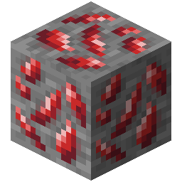
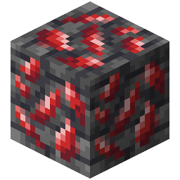

!!! info inline end ""
    

    <h3>**Adamantite Ore**</h3>
     
    <h3>**Deepslate Adamantite Ore**</h3>
    
    ---
    **Mining Level**: Needs Diamond Tools 
    **Max Vein Size**: 5 
    **Attempts Per Chunk**: 1 
    **Spawn Range**: -54 to -20 (Triangle Range) 
    **Discard Chance**: 12.5% 

## Generation

## Usages

## Trivia

## History
