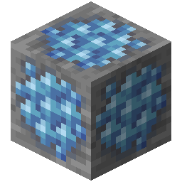

!!! info inline end ""
    

    <h3>**Aquarium Ore**</h3>
     
    ---
    **Mining Level**: Needs Iron Tools 
    **Max Vein Size**: 10 
    **Attempts Per Chunk**: 5 
    **Spawn Range**: 21 to 69 
    **Discard Chance**: Never discarded 

## Generation

## Usages

## Trivia

## History