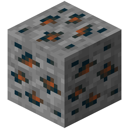
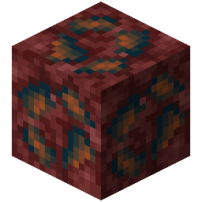

!!! info inline end ""
    

    <h3>**Banglum Ore**</h3>
     
    ---
    **Mining Level**: Needs Iron Tools 
    **Max Vein Size**: 7 
    **Attempts Per Chunk**: 3 
    **Spawn Range**: 48 to 69 
    **Discard Chance**: 12.5% 
    ---
    <h3>**Nether Banglum Ore**</h3>
     
    ---
    **Mining Level**: Needs Iron Tools 
    **Max Vein Size**: 10 
    **Attempts Per Chunk**: 4 
    **Spawn Range**: 69 to 110 
    **Discard Chance**: 12.5% 

## Generation

## Usages

## Trivia

## History
