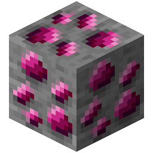
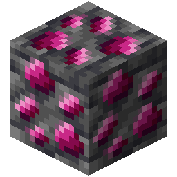

!!! info inline end ""
    

    <h3>**Carmot Ore**</h3>
     
    <h3>**Deepslate Carmot Ore**</h3>
     
    ---
    **Mining Level**: Needs Iron Tools (Diamond for Deepslate) 
    **Max Vein Size**: 4 
    **Attempts Per Chunk**: 1 
    **Spawn Range**: -24 to 10 
    **Discard Chance**: 12.5% 

## Generation

## Usages

## Trivia

## History
