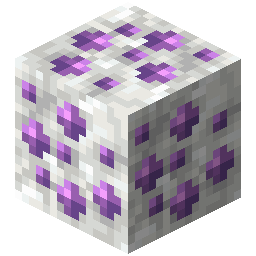

!!! info inline end ""
    

    <h3>**Kyber Ore**</h3>
     
    ---
    **Mining Level**: Needs Iron Tools 
    **Max Vein Size**: 3 
    **Attempts Per Chunk**: 1 
    **Spawn Range**: 12 to 52 
    **Discard Chance**: 50.0% 
    ---
    <h3>**Calcite Kyber Ore**</h3>
     
    ---
    **Mining Level**: Needs Iron Tools 
    **Max Vein Size**: 16 
    **Attempts Per Chunk**: 40 
    **Spawn Range**: -56 to 40 
    **Discard Chance**: 40.0% 

## Generation

Calcite Kyber spawns much more frequently within Calcite. In a vanilla-like setting, this means it only naturally generates inside the Calcite within Amethyst Geodes. 

## Usages

## Trivia

## History