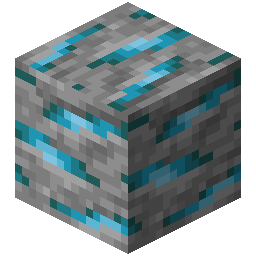
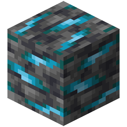

!!! info inline end ""
    

    <h3>**Morkite Ore**</h3>
     
    <h3>**Deepslate Morkite Ore**</h3>
     
    ---
    **Mining Level**: Needs Iron Tools 
    **Max Vein Size**: 11 
    **Attempts Per Chunk**: 3 
    **Spawn Range**: -37 (Offset by 27) to 32 
    **Discard Chance**: 25.0% 

## Generation

## Usages

## Trivia

## History
