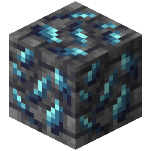

!!! info inline end ""
    

    <h3>**Mythril Ore**</h3>
     
    <h3>**Deepslate Mythril Ore**</h3>
     
    ---
    **Mining Level**: Needs Diamond Tools 
    **Max Vein Size**: 5 
    **Attempts Per Chunk**: 1 
    **Spawn Range**: -24 to 4 (Triangle Range) 
    **Discard Chance**: 12.5% 

## Generation

## Usages

## Trivia

## History
