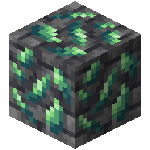

!!! info inline end ""
    

    <h3>**Orichalcum Ore**</h3>
     
    <h3>**Deepslate Orichalcum Ore**</h3>
     
    <h3>**Tuff Orichalcum Ore**</h3>
     
    <h3>**Smooth Basalt Orichalcum Ore**</h3>
     
    ---
    **Mining Level**: Needs Diamond Tools 
    **Max Vein Size**: 5 
    **Attempts Per Chunk**: 1 
    **Spawn Range**: -52 (Offset by 8) to 8 
    **Discard Chance**: Never discarded 

## Generation

## Usages

## Trivia

## History
