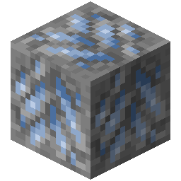

!!! info inline end ""
    

    <h3>**Osmium Ore**</h3>
     
    ---
    **Mining Level**: Needs Iron Tools 
    **Max Vein Size**: 6 
    **Attempts Per Chunk**: 5 
    **Spawn Range**: 50 to 120 
    **Discard Chance**: 25.0% 

## Generation

This ore only generates in mountainous biomes. 

## Usages

## Trivia

## History