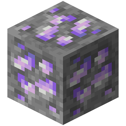

!!! info inline end ""
    

    <h3>**Platinum Ore**</h3>
     
    ---
    **Mining Level**: Needs Iron Tools 
    **Max Vein Size**: 6 
    **Attempts Per Chunk**: 2 
    **Spawn Range**: 8 to 32 (Triangle Range) 
    **Discard Chance**: 12.5% 

## Generation

## Usages

## Trivia

## History
