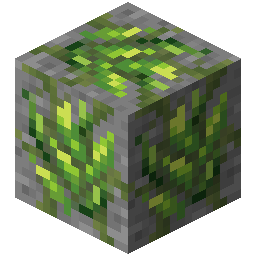
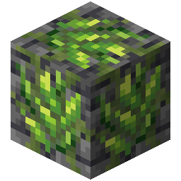

!!! info inline end ""
    

    <h3>**Prometheum Ore**</h3>
     
    <h3>**Deepslate Prometheum Ore**</h3>
     
    ---
    **Mining Level**: Needs Diamond Tools 
    **Max Vein Size**: 6 
    **Attempts Per Chunk**: 4 
    **Spawn Range**: -34 (Offset by 30) to 48 
    **Discard Chance**: Never discarded 

## Generation

This ore only generates in Jungle biomes and Lush Caves. 

## Usages

## Trivia

## History
