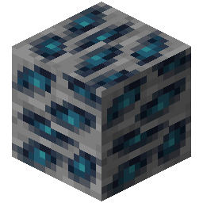

!!! info inline end ""
    

    <h3>**Quadrillum Ore**</h3>
     
    ---
    **Mining Level**: Needs Iron Tools 
    **Max Vein Size**: 7 
    **Attempts Per Chunk**: 2 
    **Spawn Range**: 12 to 40 
    **Discard Chance**: 25.0% 

## Generation

## Usages

## Trivia

## History
