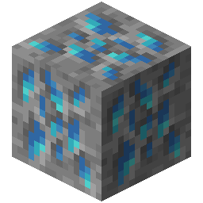
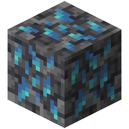

!!! info inline end ""
    

    <h3>**Runite Ore**</h3>
     
    ---
    **Mining Level**: Needs Iron Tools 
    **Max Vein Size**: 3 
    **Attempts Per Chunk**: 1 
    **Spawn Range**: 39 to 53 (Triangle Range) 
    **Discard Chance**: 50.0% 
    ---
    <h3>**Deepslate Runite Ore**</h3>
     
    ---
    **Mining Level**: Needs Iron Tools 
    **Max Vein Size**: 4 
    **Attempts Per Chunk**: 2 
    **Spawn Range**: -55 to 37 (Triangle Range) 
    **Discard Chance**: 50.0% 

## Generation

## Usages

## Trivia

## History
