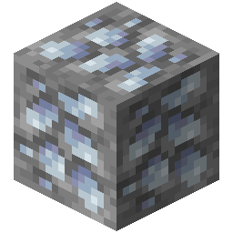

!!! info inline end ""
    

    <h3>**Silver Ore**</h3>
     
    ---
    **Mining Level**: Needs Iron Tools 
    **Max Vein Size**: 8 
    **Attempts Per Chunk**: 4 
    **Spawn Range**: 25 to 42 
    **Discard Chance**: 25.0% 

## Generation

## Usages

## Trivia

## History
