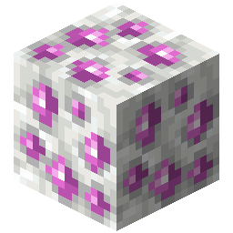

!!! info inline end ""
    

    <h3>**Starrite Ore**</h3>
     
    <h3>**Calcite Starrite Ore**</h3>
     
    ---
    **Mining Level**: Needs Diamond Tools 
    **Max Vein Size**: 4 
    **Attempts Per Chunk**: 1 
    **Spawn Range**: 70 to 260 
    **Discard Chance**: 12.5% 
    ---
    <h3>**End Stone Starrite Ore**</h3>
     
    ---
    **Mining Level**: Needs Netherite Tools 
    **Max Vein Size**: 8 
    **Attempts Per Chunk**: 2 
    **Spawn Range**: 30 to 90 
    **Discard Chance**: Never Discarded 

## Generation

## Usages

## Trivia

## History

