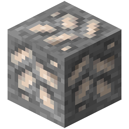

!!! info inline end ""
    

    <h3>**Tin Ore**</h3>
     
    ---
    **Mining Level**: Needs Stone Tools 
    **Max Vein Size**: 8 
    **Attempts Per Chunk**: 4 
    **Spawn Range**: 64 to 92 
    **Discard Chance**: 25.0% 

## Generation

## Usages

## Trivia

## History
