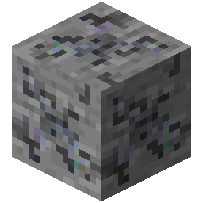

!!! info inline end ""
    

    <h3>**Unobtainium Ore**</h3>
     
    <h3>**Deepslate Unobtainium Ore**</h3>
     
    ---
    **Mining Level**: Needs Netherite Tools 
    **Max Vein Size**: 3 
    **Attempts Per Chunk**: 1 
    **Spawn Range**: -54 to 5 (Triangle Range) 
    **Discard Chance**: Never discarded 

## Generation

## Usages

## Trivia

## History
