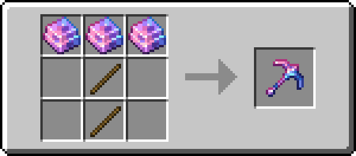
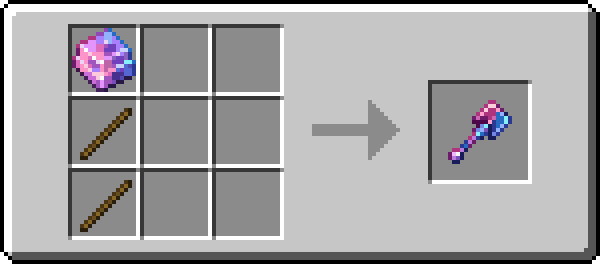

!!! info inline end ""
    

    <h4>**Stormyx Sword**</h4>
    { .sized-image style="--image-width: 40%;" } 
    +7.5 Attack Damage, 1.6 Attack Speed 
    1305 Durability 

    

    <h4>**Stormyx Axe**</h4>
    { .sized-image style="--image-width: 40%;" } 
    +9.5 Attack Damage, 0.9 Attack Speed 
    1305 Durability 

    

    <h4>**Stormyx Pickaxe**</h4>
    { .sized-image style="--image-width: 40%;" } 
    +6.5 Attack Damage, 1.2 Attack Speed 
    1305 Durability 

    

    <h4>**Stormyx Shovel**</h4>
    { .sized-image style="--image-width: 40%;" } 
    +5.5 Attack Damage, 1.1 Attack Speed 
    1305 Durability 

    

    <h4>**Stormyx Hoe**</h4>
    { .sized-image style="--image-width: 40%;" } 
    +4.5 Attack Damage, 1.0 Attack Speed 
    1305 Durability 

{ .sized-recipe style="--image-width: 40%;" } 
{ .sized-recipe style="--image-width: 40%;" } 
{ .sized-recipe style="--image-width: 40%;" } 
{ .sized-recipe style="--image-width: 40%;" } 
{ .sized-recipe style="--image-width: 40%;" } 