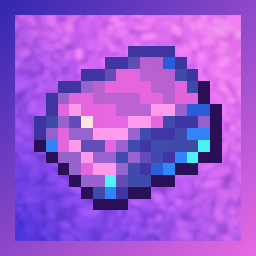

# Welcome to the Work In Progress Mythic Metals Wiki

### :material-account: For Users
!!! info inline end ""
    Hey this is the ***top text***
    
    this picture would probably be an ore or ingot
    
    imagine this block with some nice to know stats
    maybe something more idk yet
- If you're a user, you're probably looking for unobtainium. I have not written that page yet, and it will probably the last one.
- You can also find epic docs for some of the other pies I have dipped my fingers into, over at [https://docs.wispforest.io](https://docs.wispforest.io)
- The documentation for [Mythic Metals](mythicmetals/home.md) is also available here. Who would have guessed.

### :material-code-json: For Developers
- Just ask me in the **Wraith Coding Sesh Discord Server** if you want to integrate your mod with mine. I will gladly help out/make hooks for my mod if you need them. 

***

### :simple-github: Sources 

The entirety of this site will be available [on GitHub](https://github.com/wisp-forest/docs), where you can submit additions and corrections or report issues you found