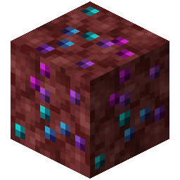
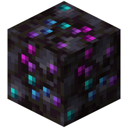

!!! info inline end ""
    

    <h3>**Stormyx Ore**</h3>
     
    <h3>**Blackstone Stormyx Ore**</h3>
    
    ---
    **Mining Level**: X (Y for variant) 
    **Max Vein Size**: 9 
    **Spawn Range**: 4 to 60 
    **Discard Chance**: Never discarded 