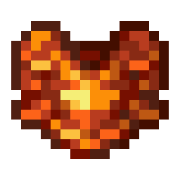
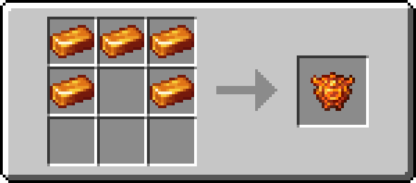

# 钯金盔甲

!!! info inline end ""
    

    <h3>**钯金盔甲**</h3>
    

    

    <h4>**钯金头盔**</h4>
    { .sized-image style="--image-width: 40%;" } 
    { .sized-image style="--image-width: 8%;" }
    { .sized-image style="--image-width: 8%;" }
     
    +3 护甲值, +2.0 盔甲韧性 
    336 耐久度 

    

    <h4>**钯金胸甲**</h4>
    { .sized-image style="--image-width: 40%;" } 
    { .sized-image style="--image-width: 8%;" }
    { .sized-image style="--image-width: 8%;" }
    { .sized-image style="--image-width: 8%;" }
    { .sized-image style="--image-width: 8%;" }
     
    +8 护甲值, +2.0 盔甲韧性s 
    448 耐久度 

    

    <h4>**钯金护腿**</h4>
    { .sized-image style="--image-width: 40%;" } 
    { .sized-image style="--image-width: 8%;" }
    { .sized-image style="--image-width: 8%;" }
    { .sized-image style="--image-width: 8%;" }
     
    +6 护甲值, +2.0 盔甲韧性 
    420 耐久度 

    

    <h4>**钯金靴子**</h4>
    { .sized-image style="--image-width: 40%;" } 
    { .sized-image style="--image-width: 8%;" }
    { .sized-image style="--image-width: 8%;" }
     
    +3 护甲值, +2.0 盔甲韧性 
    364 耐久度 
    ---
    *能力 - 天然防火：* 
    穿戴时可提供额外的火焰保护。 

钯金盔甲是一套橙色的盔甲套装，具有多种与火相关的特性。这套盔甲具有防火功能，类似于下界合金，因此**掉入岩浆中也不会燃烧**。

大多数装备都具有熔岩中移动速度属性，其效果正如其名。头盔则带有熔岩中视野属性，当您浸没在熔岩中时，该属性会将您的视野范围增加指定的方块数。

该套装还附带了天然防火能力，当穿戴时，它相当于额外一层火焰保护附魔效果。此能力与附魔效果本身可叠加。

## 获取

### 制作

钯金盔甲可以用[钯金锭](https://youtu.be/6wWHZE14hP8)制作，这种资源可以在 下界 中找到。它的制作方式和其他盔甲一样。

{ .sized-recipe style="--image-width: 40%;" } 
{ .sized-recipe style="--image-width: 40%;" } 
{ .sized-recipe style="--image-width: 40%;" } 
{ .sized-recipe style="--image-width: 40%;" } 

## 趣闻

钯金盔甲算作保暖盔甲，因为它在 `minecraft:freeze_immune_wearables` 标签中。这意味着当你穿着它的任何部件时，不会受到冰冻伤害。

钯金靴子也有一些有趣的用途，比如穿上它们站在篝火和岩浆方块上不会受到伤害。穿上这双靴子时，你也不会陷入细雪中，除非你在潜行。
