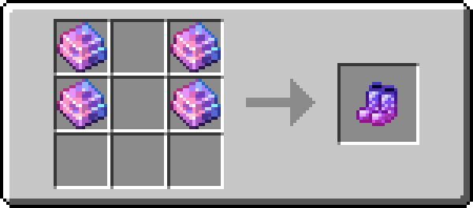

# 飓霆盔甲

!!! info inline end ""
    

    <h3>**飓霆盔甲**</h3>
    
    <h4>**飓霆头盔**</h4>
    { .sized-image style="--image-width: 40%;" } 
    { .sized-image style="--image-width: 8%;" }
    { .sized-image style="--image-width: 8%;" }
     
    +3 护甲值, +2.0 盔甲韧性 
    360 耐久度 

    

    <h4>**飓霆胸甲**</h4>
    { .sized-image style="--image-width: 40%;" } 
    { .sized-image style="--image-width: 8%;" }
    { .sized-image style="--image-width: 8%;" }
    { .sized-image style="--image-width: 8%;" }
    { .sized-image style="--image-width: 8%;" }
     
    +8 护甲值, +2.0 盔甲韧性 
    480 耐久度 

    

    <h4>**飓霆护腿**</h4>
    { .sized-image style="--image-width: 40%;" } 
    { .sized-image style="--image-width: 8%;" }
    { .sized-image style="--image-width: 8%;" }
    { .sized-image style="--image-width: 8%;" }
     
    +6 护甲值, +2.0 盔甲韧性 
    450 耐久度 

    

    <h4>**飓霆靴子**</h4>
    { .sized-image style="--image-width: 40%;" } 
    { .sized-image style="--image-width: 8%;" }
    { .sized-image style="--image-width: 8%;" }
     
    +3 护甲值, +2.0 盔甲韧性 
    390 耐久度 
    ---
    *能力 - 魔法保护：*  
    固定减少 X 点魔法伤害。 
    

飓霆盔甲是一套标准的护甲套装，因其独特的粉色和青色而易于辨认。这套护甲具有魔法保护属性，能直接减少受到的魔法伤害。

## 获取

### 制作

飓霆盔甲可以用[飓霆锭](https://youtu.be/nEmXCTZN154)制作，这种资源可以在下界找到。它的制作方式和其他盔甲一样。

{ .sized-recipe style="--image-width: 40%;" } 
{ .sized-recipe style="--image-width: 40%;" } 
{ .sized-recipe style="--image-width: 40%;" } 
{ .sized-recipe style="--image-width: 40%;" } 

### 交易

偶尔，在使用迈达斯金与猪灵进行交易时，你有很小的几率获得附有灵魂疾行和/或耐久魔咒的飓霆靴子。每次交易获得的几率约为 1%。
