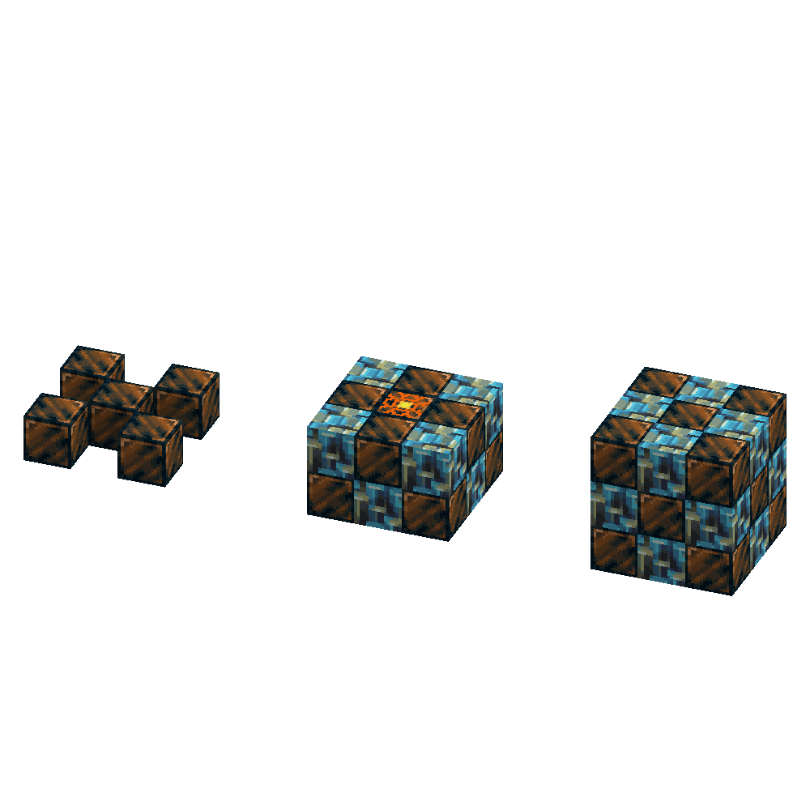
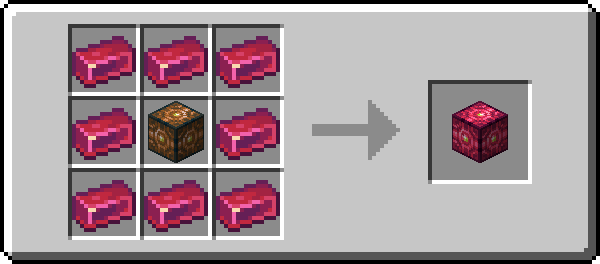
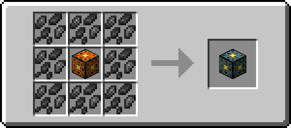

*War... War never changes*

所以你想学怎么造核弹，是吧？其实也没你想的那么难。不过确实需要很多特殊材料。

## 多方块结构

您将需要大量的聚爆石和墨菱石。这个多方块结构将耗费您 14 个聚爆石方块和 12 个墨菱石方块，结构如下：

要制作炸弹的核心部分，你也需要一个聚爆石碎块。

![Picture of the recipe of a Banglum Nuke Core. [BMB][MCM][BMB] B = Raw Banglum Block, M = Morkite Block, C = Banglum Chunk](../../assets/mythicmetals/recipes/blocks/banglum_nuke_core.png){ .sized-recipe style="--image-width: 50%;" } 

要最终点燃它，只需用上你那可靠的火石和钢条……

然后……你给路打油！

---

## 独特的核弹芯

有些人可能会问：“你们如何使用不同的核弹芯？”

嗯，很简单：建造时用新的核芯替换掉聚爆石核弹核心。仅此而已，别无其他。

### 点金石核弹核心

使用这个核弹核心，爆炸时会神奇地排除所有矿石。

{ .sized-recipe style="--image-width: 50%;" } 

### 兆金核弹核心

这种核弹核心会牺牲一部分爆炸半径，但是将爆炸造成的伤害提高一倍。

{ .sized-recipe style="--image-width: 50%;" } 
