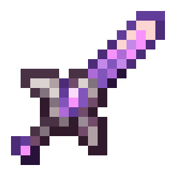
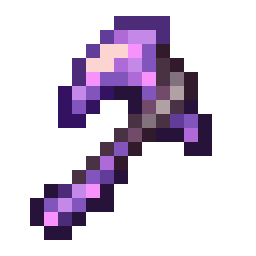
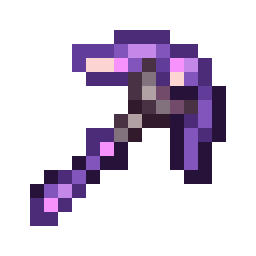
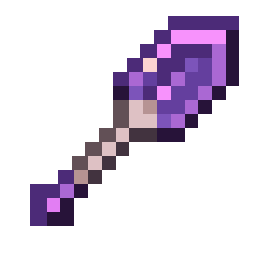
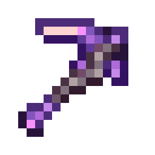
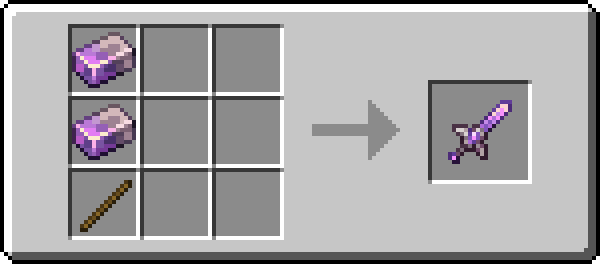
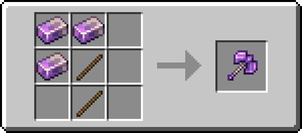
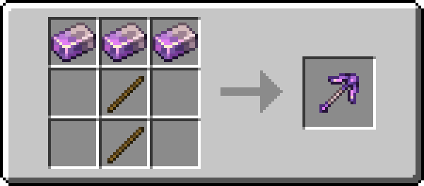
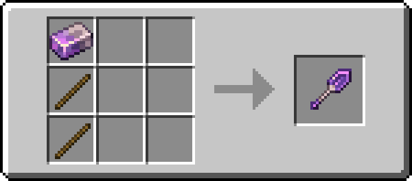
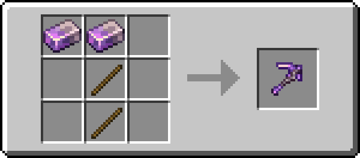

!!! info inline end ""
    

    <h3>**Kyber Tools**</h3>
    <h4>**Kyber Sword**</h4>
    { .sized-image style="--image-width: 40%;" } 
    +6.5 Attack Damage, 5.6 Attack Speed 
    889 Durability 

    <h4>**Kyber Axe**</h4>
    { .sized-image style="--image-width: 40%;" } 
    +8.5 Attack Damage, 5.0 Attack Speed 
    889 Durability 

    <h4>**Kyber Pickaxe**</h4>
    { .sized-image style="--image-width: 40%;" } 
    +5.5 Attack Damage, 5.2 Attack Speed 
    889 Durability 

    <h4>**Kyber Shovel**</h4>
    { .sized-image style="--image-width: 40%;" } 
    +4.5 Attack Damage, 5.1 Attack Speed 
    889 Durability 

    <h4>**Kyber Hoe**</h4>
    { .sized-image style="--image-width: 40%;" } 
    +3.5 Attack Damage, 5.0 Attack Speed 
    889 Durability 

{ .sized-recipe style="--image-width: 40%;" } 
{ .sized-recipe style="--image-width: 40%;" } 
{ .sized-recipe style="--image-width: 40%;" } 
{ .sized-recipe style="--image-width: 40%;" } 
{ .sized-recipe style="--image-width: 40%;" } 
