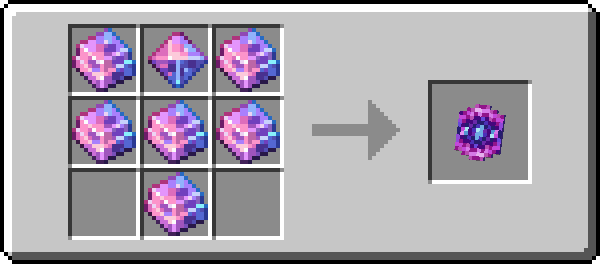

# 飓霆盾

!!! info inline end ""
    

    <h3>**飓霆盾**</h3>
    { .sized-image style="--image-width: 40%;" } 
    +2 魔法保护 
    1680 耐久度 
    ---
    *能力 - 魔法保护：*  
    固定减少 X 点魔法伤害。 
    

飓霆盾是一件由[飓霆](../materials/stormyx.md)打造而成的圆形魔法盾牌。

与标准盾牌相比，它有一些小优势。首先，它在损失耐久度前能够承受更高的伤害。标准盾牌在损失耐久度前可吸收 3 点伤害，而飓霆盾可吸收 4 点伤害。此外，在计算耐久度损失时，它会向下取整，而不是向上取整。

其次，当被斧头击中并暂时失效时，它的冷却时间更短，仅为 4 秒（80 刻），使你能够更快地重新使用它。

## 获取

### 制作

飓霆盾由[飓霆锭](https://youtu.be/nEmXCTZN154)打造而成，这种资源可在下界中找到。您还需要一个[飓霆贝壳](../materials/rare-drops.md)，这是一种在挖掘飓霆矿石时掉落的稀有物品。

{ .sized-recipe style="--image-width: 40%;" } 
