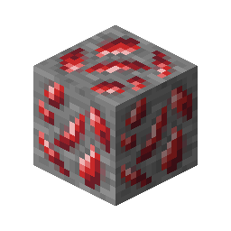
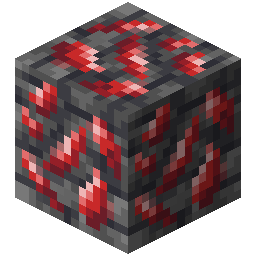

!!! info inline end ""
    

    <h3>**精金矿石**</h3>
     
    <h3>**深层精金矿石**</h3>
    
    ---
    **挖掘等级**： X (Y 代表变种) 
    **最大矿脉尺寸**： 5 
    **生成范围**： -54 至 -20 （三角形范围） 
    **（生成时）丢弃几率**： 12.5% 

## 生成

## 使用

## 趣闻

## 历史
